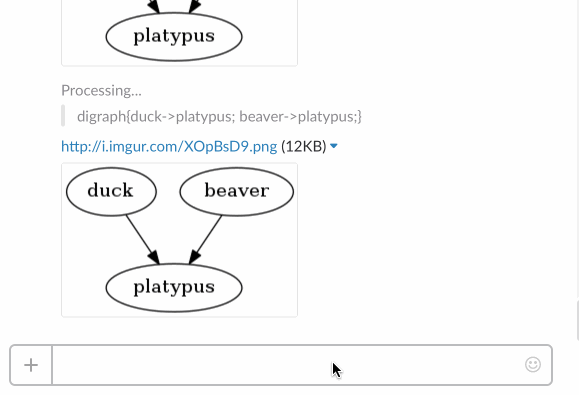
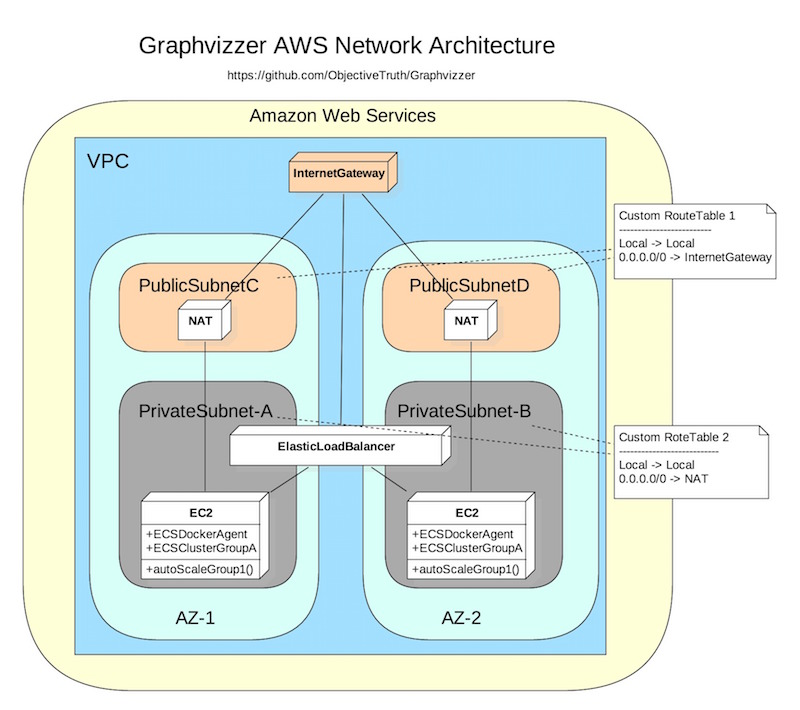

#  Graphvizzer 

Makes graphs with imgur links directly in your chat channel, instantly, using the popular [DOT](http://www.graphviz.org/content/dot-language) notation. 

## History

I love diagram.. as you can see from this repo. Software is created by people and as the team grows, communication becomes more and more difficult. I use `Graphviz` alot to communicate ideas and reduce ambiguity. I hope you'll find it helpful too!

*replacing the word warfare with software*

>Fleet Marine Force Manual 1, Warfighting 
>
“Software is a complex endeavor. It is shaped by
the human will. It is characterized by friction,
uncertainty, fluidity, danger and disorder. While the
nature of software is constant, it remains
unpredictable, and is affected by a mix of physical,
moral and mental factors. While software has the
characteristics of both art and science, it is
primarily shaped by human experience”.

## Architecture

Uses [Play2! Scala](https://www.playframework.com/) to communicate between [imgur](http://imgur.com/) and [Slack](https://slack.com/)

### Deployment Diagram

### Interaction Diagram

## Project Setup

[IntelliJ](https://www.jetbrains.com/idea/) is the recommended way to edit the project

Simply import the project based on an `sbt` model to get started

### Integration Tests

`activator test`

### Building the docker

1. Package the `Play2!-Scala` app

  `activator universal:packageZipTarball`

2. Build the `Docker` image

  `docker build -t objectivetruth/graphvizzer .`
  
3. Push the image to `Docker Hub`

  `docker push objectivetruth/graphvizzer:latest`

## License

[GNU General Public License v3.0](http://choosealicense.com/licenses/gpl-3.0/#)

