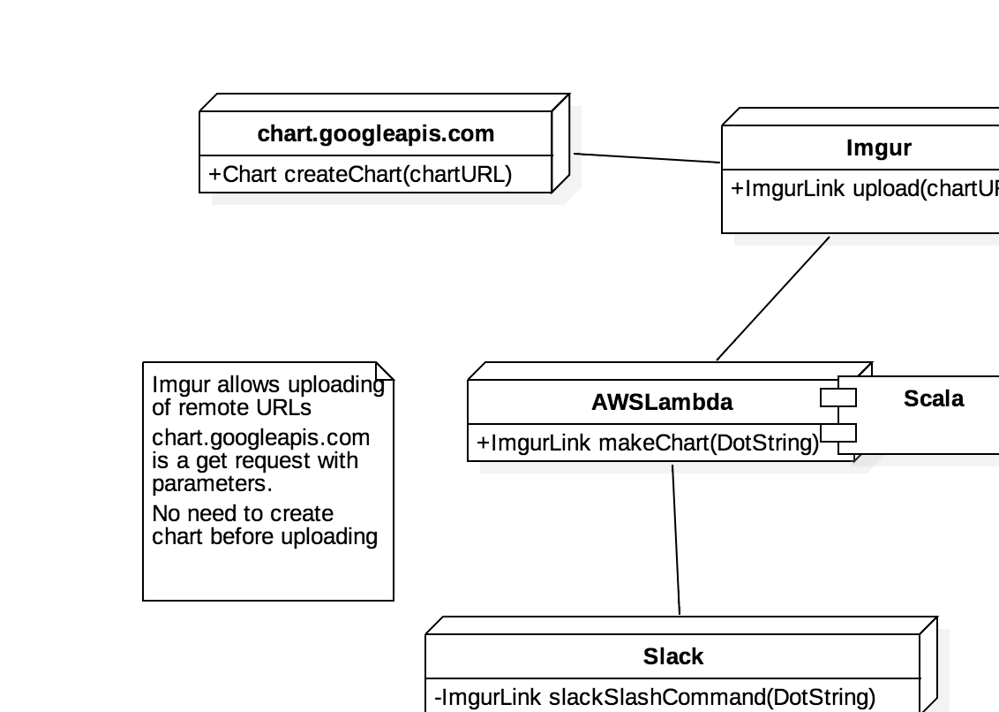

# Graphviz-Slack-App

Makes graphs with imgur links directly in your chat channel, instantly, using the popular [DOT](http://www.graphviz.org/content/dot-language) notation. 

## History

I love diagram.. as you can see from this repo. Software is created by people and as the team grows, communication becomes more and more difficult. I use `Graphviz` alot to communicate ideas and reduce ambiguity. I hope you'll find it helpful too!

*replacing the word warfare with software*

>Fleet Marine Force Manual 1, Warfighting 
>
“Software is a complex endeavor. It is shaped by
the human will. It is characterized by friction,
uncertainty, fluidity, danger and disorder. While the
nature of software is constant, it remains
unpredictable, and is affected by a mix of physical,
moral and mental factors. While software has the
characteristics of both art and science, it is
primarily shaped by human experience”.

## Architecture

Uses [AWS Lambdas](https://aws.amazon.com/lambda/details/) to between [imgur](http://imgur.com/) and  [Google Graphviz Chart API](https://developers.google.com/chart/image/docs/gallery/graphviz)

### Deployment Diagram

### Interaction Diagram

## License

[GNU General Public License v3.0](http://choosealicense.com/licenses/gpl-3.0/#)

